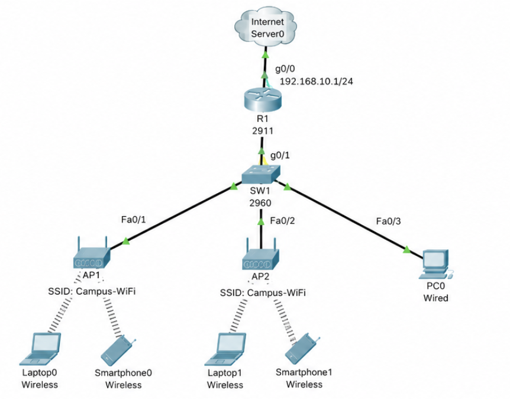
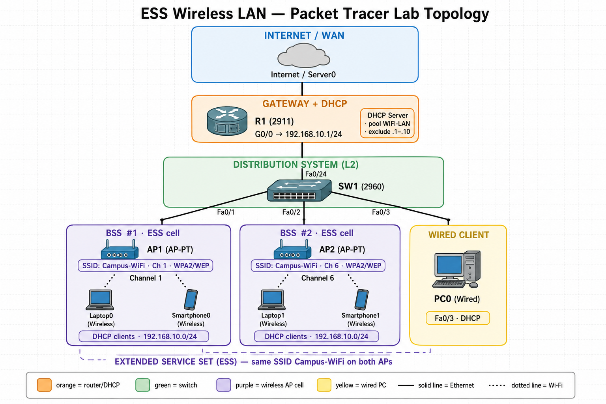

# CCNA Packet Tracer Lab – Extended Service Set (ESS) Wireless LAN

## Lab Overview

An **Extended Service Set (ESS)** is a wireless LAN architecture where **multiple Access Points (APs)** connect to the same wired network and share the **same SSID**. That extends coverage and lets clients **roam** between AP cells while staying on one logical WLAN.

This lab builds a small ESS in Packet Tracer: two APs, a switch, a router with DHCP, wireless and wired clients, then verifies connectivity and practices troubleshooting.

**Concepts covered:** BSS vs ESS, SSID / BSSID, AP bridging to Ethernet, DHCP for wireless clients, roaming, and wireless + Layer 3 troubleshooting.

**Prerequisite:** Basic switch CLI, IP addressing, and DHCP from earlier labs.

---

# Key Concepts (Quick Review)


| Term      | Meaning                                                                               |
| --------- | ------------------------------------------------------------------------------------- |
| **BSS**   | One AP and its associated clients (one cell)                                          |
| **ESS**   | Two or more BSSs sharing the **same SSID**, linked by a **wired distribution system** |
| **SSID**  | Network name clients join (e.g. `Campus-WiFi`)                                        |
| **BSSID** | Usually the AP radio MAC — identifies a specific AP cell                              |
| **DS**    | Distribution system (typically the switch/router LAN tying APs together)              |


**Design rule for this lab:** Same SSID + same authentication on both APs + both APs on the **same VLAN/subnet** = clients keep the same IP and default gateway when they roam.

---

# Network Topology

```text
                    [ Internet / Server0 ]
                              |
                         R1 (2911)
                    g0/0 192.168.10.1/24
                              |
                           SW1 (2960)
                    /         |         \
                 Fa0/1     Fa0/2      Fa0/3
                   |         |          |
                 AP1       AP2        PC0 (wired)
              SSID:        SSID:
           Campus-WiFi  Campus-WiFi
                   \         /
                    \       /
                 Laptop0  (roams between APs)
                 Smartphone0
```





Both APs connect to **SW1** as wired Ethernet hosts. Wireless clients associate to either AP and receive addresses from **R1 DHCP** on `192.168.10.0/24`.

---

# Devices Needed


| Device                                                | Role                              |
| ----------------------------------------------------- | --------------------------------- |
| 1× Router (2911) – `R1`                               | Default gateway + DHCP server     |
| 1× Switch (2960) – `SW1`                              | Wired distribution system for APs |
| 2× Access Point (e.g. Access Point-PT) – `AP1`, `AP2` | ESS radios, same SSID             |
| 1× PC – `PC0`                                         | Wired verification host           |
| 1× Laptop – `Laptop0`                                 | Roaming wireless client           |
| 1× Smartphone (or tablet) – `Smartphone0`             | Second wireless client            |
| 1× Server (optional) – `Server0`                      | HTTP target beyond the LAN        |


**Cable APs and PC0 with Copper Straight-Through** to the switch. Place Laptop0 and Smartphone0 in wireless range of the APs (adjust positions so each AP covers a distinct area that overlaps slightly for roaming).

---

# Address Plan


| Device / Role      | Interface | IP / Notes                                        |
| ------------------ | --------- | ------------------------------------------------- |
| R1                 | G0/0      | `192.168.10.1/24` (gateway)                       |
| SW1                | —         | Layer 2 only (no SVI required)                    |
| AP1 / AP2          | Ethernet  | DHCP or static unused — radio config matters more |
| PC0                | Fa0       | DHCP (`192.168.10.0/24`)                          |
| Laptop0            | Wireless0 | DHCP after associate                              |
| Smartphone0        | Wireless0 | DHCP after associate                              |
| Server0 (optional) | Fa0       | `192.168.10.50` or attach on R1 LAN               |


| DHCP pool  | Network           | Gateway        | DNS (example)               |
| ---------- | ----------------- | -------------- | --------------------------- |
| `WIFI-LAN` | `192.168.10.0/24` | `192.168.10.1` | `192.168.10.1` or `8.8.8.8` |


**Exclude** `.1`–`.10` from DHCP so gateway/static devices stay clear.

---

# Wireless Settings (ESS)


| Setting        | Value                                                                    |
| -------------- | ------------------------------------------------------------------------ |
| SSID           | `Campus-WiFi`                                                            |
| Authentication | WPA2-PSK (or WEP in PT if device limited — use same on both APs)         |
| Passphrase     | `CiscoLab123` (example — change if you prefer)                           |
| Channel        | AP1: channel **1** · AP2: channel **6** (reduce co-channel interference) |
| DHCP           | Clients: **DHCP** via R1                                                 |


Both APs must use the **identical SSID and security**. Different SSIDs = IBSS-like / separate networks, not one ESS.

---

# Step 0 — Build and Cable

1. Drag devices into Packet Tracer and name them (`R1`, `SW1`, `AP1`, `AP2`, `PC0`, `Laptop0`, `Smartphone0`).
2. Cable:


| From | Port              | To  | Port   |
| ---- | ----------------- | --- | ------ |
| R1   | Gig0/0            | SW1 | Fa0/24 |
| AP1  | Port 0 (Ethernet) | SW1 | Fa0/1  |
| AP2  | Port 0 (Ethernet) | SW1 | Fa0/2  |
| PC0  | FastEthernet0     | SW1 | Fa0/3  |


1. Place **AP1** and **AP2** apart so each covers one area; put Laptop0 first near AP1.

---

# Step 1 — Configure the Router (Gateway + DHCP)

On **R1**:

```cisco
enable
configure terminal
hostname R1

interface GigabitEthernet0/0
 ip address 192.168.10.1 255.255.255.0
 no shutdown
exit

ip dhcp excluded-address 192.168.10.1 192.168.10.10

ip dhcp pool WIFI-LAN
 network 192.168.10.0 255.255.255.0
 default-router 192.168.10.1
 dns-server 192.168.10.1
exit

end
write memory
```

**Check:** `show ip interface brief` — G0/0 up/up. `show ip dhcp pool` — pool present.

---

# Step 2 — Switch Access Ports

APs and the wired PC are access ports on the same VLAN (default VLAN 1 is fine for this lab).

On **SW1** (optional hardening of names / description only):

```cisco
enable
configure terminal
hostname SW1

interface range FastEthernet0/1-3
 switchport mode access
 switchport access vlan 1
 no shutdown
exit

interface FastEthernet0/24
 switchport mode access
 switchport access vlan 1
 no shutdown
exit

end
write memory
```

**Check:** `show vlan brief` — Fa0/1–3 and Fa0/24 in VLAN 1. Link lights should be green to R1, APs, and PC0.

---

# Step 3 — Configure Both Access Points (Same SSID)

AP-PT has **no CLI**. You configure it with the GUI. Do this on **AP1**, then the same on **AP2** (only the **channel** differs).

### Where to click (AP-PT)

1. Click the access point on the workspace.
2. Open the **Config** tab.
3. In the left pane, under **INTERFACE**, click **Port 1** (this is the **wireless** radio — not the Ethernet port).

### Settings on Port 1 (wireless)


| Setting             | AP1           | AP2                                 |
| ------------------- | ------------- | ----------------------------------- |
| **SSID**            | `Campus-WiFi` | `Campus-WiFi` (exact same spelling) |
| **Authentication**  | WPA2-PSK      | WPA2-PSK                            |
| **PSK Pass Phrase** | `CiscoLab123` | `CiscoLab123` (exact same)          |
| **Channel**         | `1`           | `6`                                 |


Leave **Port 0** (Ethernet toward the switch) alone — default / enabled is fine. You usually do **not** need to set an IP on the AP for this lab; it just bridges wireless clients onto the switch.

### Why this matters

- Same **SSID + password** on both APs = one ESS (clients see one network and can roam).
- Different **channels** (1 and 6) reduces interference between the two APs.
- A typo in SSID or passphrase (e.g. `Campus-Wifi` vs `Campus-WiFi`) means you built two separate networks, not an ESS.

**Check:** After both APs are set, a laptop’s wireless list should show **one** `Campus-WiFi` SSID (you may still associate to either AP by physical location).

---

# Step 4 — Connect Wireless Clients

### Laptop0 — add a wireless NIC first (required)

Laptop-PT has **no Wi‑Fi card by default**. If **PC Wireless** says *“A WMP300N or WPC300N wireless interface is required”*, install one:

1. Click **Laptop0** → **Physical** tab.
2. Click the laptop’s **power button** to turn it **OFF**.
3. Drag the current module out of the side slot into inventory (bottom).
4. Drag **WPC300N** (or **WMP300N**) from modules into the empty slot.
5. Click the power button again to turn it **ON**.

Then connect:

1. **Desktop** → **PC Wireless**.
2. Connect to SSID `**Campus-WiFi`** with the same passphrase/key as the APs.
3. **Desktop** → **IP Configuration** → **DHCP**.

### Smartphone0

Smartphones already have Wi‑Fi built in (no WPC300N needed). Drag **Smartphone0** close to **AP1** or **AP2** so it is in range.

**Way A — Config tab (most reliable):**

1. Click **Smartphone0** → **Config** tab.
2. Left pane → **INTERFACE** → **Wireless0**.
3. Set:
  - **SSID:** `Campus-WiFi`
  - **Authentication:** same as the APs (e.g. **WEP** or **WPA2-PSK**)
  - **Key / Pass Phrase:** same as the APs
4. Left pane → **Settings** (or **Global Settings**) → **IP Configuration** → **DHCP**.

**Way B — Desktop:**

1. **Desktop** → **Wireless** (or the Wi‑Fi / Config wireless icon, depending on PT version).
2. Connect to / enter SSID `**Campus-WiFi`** with the same security and key as the APs.
3. **Desktop** → **IP Configuration** → **DHCP**.

**If it won’t connect:** security type or key doesn’t match the APs, or the phone is too far from both APs — move it closer and double-check SSID/key (including WEP hex key if you used WEP).

### PC0 (wired control)

1. Desktop → IP Configuration → **DHCP**.

**Check each client:**


| Field   | Expected                              |
| ------- | ------------------------------------- |
| IP      | `192.168.10.x` (above excluded range) |
| Mask    | `255.255.255.0`                       |
| Gateway | `192.168.10.1`                        |


On R1:

```cisco
show ip dhcp binding
```

You should see leases for the wireless and wired clients.

---

# Step 5 — Verify Connectivity

From **Laptop0** Command Prompt:

```text
ipconfig /all
ping 192.168.10.1
ping <PC0-IP>
ping <Smartphone0-IP>
```

From **PC0**:

```text
ping <Laptop0-IP>
ping <Smartphone0-IP>
```

All should succeed — wireless and wired hosts share the same Layer 2/3 segment via the ESS distribution system.

Optional: add **Server0** on the same switch with a static IP (e.g. `192.168.10.50`) and HTTP on; browse from a wireless client to prove application reachability.

---

# Step 6 — Demonstrate Roaming (ESS Behavior)

1. Note Laptop0’s **IP** and which AP it is near.
2. Physically **drag Laptop0** from AP1’s coverage into AP2’s coverage (keep within overlapping range if possible).
3. Wait a moment for reassociation.
4. Ping the gateway again:

```text
ping 192.168.10.1
```

**Expected ESS outcome:**

- Client stays on SSID `Campus-WiFi`.
- Usually keeps the **same DHCP IP** (same subnet).
- Reachability continues without reconfiguring the client.

If you used **different SSIDs** on the APs, this would feel like joining a second network — that is **not** an ESS.

---

# Step 7 — Verification Commands

**Router R1:**

```cisco
show ip interface brief
show ip dhcp binding
show ip dhcp pool
ping <client-IP>
```

**Switch SW1:**

```cisco
show mac address-table
show interfaces status
show vlan brief
```

Wireless frames are bridged onto the wired ports — client MACs appear on the AP-facing switch ports.

**Client:**

```text
ipconfig /all
ping 192.168.10.1
arp -a
```

---

# Troubleshooting Challenges

Practice breaking and fixing. Prefer one change at a time.

## Scenario 1 – Client Associates but Gets No IP

DHCP missing on R1, G0/0 down, or client set to static wrongly. Fix with `show ip dhcp binding` / `show ip interface brief`, then renew DHCP on the client.

## Scenario 2 – Sees SSID but Cannot Authenticate

SSID matches, passphrase or security type differs between AP1 and AP2 (or client). Align WPA2 settings on **both** APs and reconnect.

## Scenario 3 – Two SSIDs Appear (Not an ESS)

Typos in SSID (e.g. `Campus-Wifi` vs `Campus-WiFi`). Correct both APs to the exact same string.

## Scenario 4 – Weak Signal / Frequent Disconnect Near One AP

Client outside coverage or both APs on the **same channel** causing interference. Move the client or set channels **1** and **6**, then retest.

## Scenario 5 – Wired PC Works, Wireless Does Not

AP Ethernet cable wrong port / down, or AP not bridged to LAN. Check switch port status and AP link lights; ping gateway from a wireless client after associate.

## Scenario 6 – Ping Gateway Fails After Roam

Client fell onto a different subnet or wrong AP SSID. Confirm both APs still share SSID/security and are on the same switch VLAN; renew DHCP if needed.

---

# Stretch Goals

1. Put APs and clients in **VLAN 20**, trunk to R1, and use a subinterface + DHCP pool for that VLAN (ESS still same SSID).
2. Add a **guest SSID** on one AP only and show it is a separate BSS / different trust domain.
3. Capture traffic in **Simulation** mode and note frames going from wireless NIC → AP → switch → router.
4. Document **BSSID** difference per AP while **SSID** stays the same (Config / wireless details).

---

# Skills Learned

- Extended Service Set (ESS) design with multiple APs
- Same SSID + shared security for seamless coverage
- Bridging wireless clients onto a wired LAN (distribution system)
- DHCP for wireless and wired hosts
- Channel planning (non-overlapping channels)
- Client roaming between AP coverage areas
- Systematic wireless and LAN troubleshooting

**Maps to CCNA domains:** Network Access (wireless LAN architecture), IP Connectivity, IP Services (DHCP).

---

# Reflection

An Extended Service Set (ESS) is a wireless LAN architecture where multiple Access Points are connected to the same wired network and share the same SSID. This extends wireless coverage and enables users to move between AP coverage areas while remaining connected to the network.

This hands-on lab enhanced understanding of wireless networking concepts, ESS architecture, DHCP configuration, and network troubleshooting.

---

# What to Save

- Packet Tracer file: `ESS_Wireless_LAN.pkt` (optional, in this folder)
- Screenshot of topology with both APs and SSID labeled
- `show ip dhcp binding` output after clients associate
- Short note: what stayed the same when Laptop0 roamed (SSID, IP, gateway)

